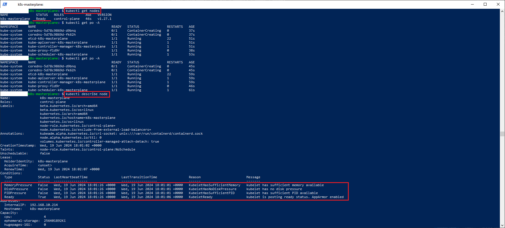
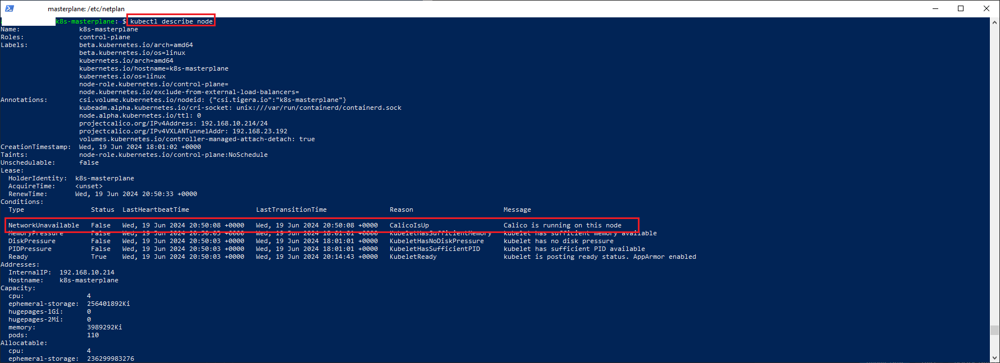

### Инструменты и дополнительные материалы, которые пригодятся для выполнения задания:

- [Considerations for large clusters](https://kubernetes.io/docs/setup/best-practices/cluster-large/),
- [Architecting Kubernetes clusters — choosing a worker node size](https://learnk8s.io/kubernetes-node-size).
- [Хорошее пособие по настройке кубов](https://github.com/BigKAA/youtube/blob/master/kubeadm/README.md)
- [Установка отказоустойчивого куба](https://habr.com/ru/articles/725640/)

------

### Задание. Необходимо определить требуемые ресурсы
Известно, что проекту нужны база данных, система кеширования, а само приложение состоит из бекенда и фронтенда. Опишите, какие ресурсы нужны, если известно:

1. Необходимо упаковать приложение в чарт для деплоя в разные окружения. 
2. База данных должна быть отказоустойчивой. Потребляет 4 ГБ ОЗУ в работе, 1 ядро. 3 копии. 
3. Кеш должен быть отказоустойчивый. Потребляет 4 ГБ ОЗУ в работе, 1 ядро. 3 копии. 
4. Фронтенд обрабатывает внешние запросы быстро, отдавая статику. Потребляет не более 50 МБ ОЗУ на каждый экземпляр, 0.2 ядра. 5 копий. 
5. Бекенд потребляет 600 МБ ОЗУ и по 1 ядру на копию. 10 копий.

### Решение

| Система                         |         CPU                                              |             Память                        |
|---------------------------------|----------------------------------------------------------|-------------------------------------------|
| Мастер нода                     |   2 ядра * 3 = 6 ядер, 3 ноды                            |  4 Гб *3 = 12 Гб                          |
| База данных                     | (3 + 0.06 + 0.01 + 0.005 = 4) ядра * 3 = 12 ядер, 3 ноды |  (4 Гб + 0.1 Гб + 1 Гб) *3 *3 = 46 Гб     |
| Кеш                             | (3 + 0.06 + 0.01 + 0.005 = 4) ядра * 3 = 12 ядер, 3 ноды |  (4 Гб + 0.1 Гб + 1 Гб) *3 *3 = 46 Гб     |
| Фронтенд                        | (0.2 + 0.06 + 0.01) * 5 = 2 ядро , 1 нода                |  0.05  Гб * 5 + 0.1 Гб + 0.255 Гб = 1 Гб  |
| Бекенд                          | (10 + 0.06 + 0.01 + 0.01 + 0.015) = 11 ядер, 1 нода      |  0.6 Гб + 0.1 Гб + 0.255 Гб = 1Гб         |
| Итого:                          |  ```43 ядра,  11 нод```                                  |  ```106 Гб```                             |  

#### Дополнительные условия использованные при расчете:

- У мастер-ноды минимальные требования: 2 ядра и 4 Гб памяти
- Для отказоустойчивости размещаем поды на 3 рабочих нодах. 
- Обеспечиваем отказоустойчивость мастер-нодам 
- Системными процессами(kubelet, kube-proxy) потребляется CPU: ```6 %``` на 1 ядре, ```1%``` на 2 и по ```0.5%``` на каждом ядре до 4 ядер, ```0.25%``` на кажом последующем ядре
- Системными процессами(kubelet, kube-proxy) потребляется памяти: ```255 Мб``` до 1 Гб, ```1 Гб``` от первых 4 Гб, ```0.8 Гб``` от вторых 4 Гб, ```0.8 Гб``` от следующих 8 Гб, ```6.72 Гб```(6%) от следующих 112 Гб.
- Существует минимальный объем свободной памяти при превышении которого под будет автоматически остановлен. Размер памяти равен ```0.1 Гб```

### Установка k8s c использованием kubeadm

1. kubelet не работает при включенном свопинге, для этого:
  - выключает свопинг на диск, т.к. kubelet не работает при включенном свопинге: 
    ```sudo swapoff -a```
  - удаляем строку начинающуюся на **/swap.img** в файле **/etc/fstab**(выключает свопинг при перезагрузке):
    ```sudo sed -i '/swap/s/^/#/' /etc/fstab```
2. устанавливаем ip_forwarding и фильтры моста. 
    1. Устанавливаем модуль фильтров(проверка наличия модуля: ```modinfo br_netfilter```, проверка что модуль br_netfilter включен: ```lsmod | grep br_netfilter```):
        - ```modprobe br_netfilter```
    2. Устанавливаем модуль оверлея(проверка наличия модуля: ```modinfo overlay```, проверка что модуль br_netfilter включен: ```lsmod | grep overlay```):
        - ```modprobe overlay```
    3. В файле ```/etc/sysctl.conf``` устнавливаем значения(устанавливаются после включения модуля ядра - **br_netfilter**):
        - ```net.ipv4.ip_forward=1```
        - ```net.bridge.bridge-nf-call-iptables=1```
        - ```net.bridge.bridge-nf-call-ip6tables=1```  
    4. Применяем настройки sysctl:
        - ```sysctl -p /etc/sysctl.conf``` 
3. Сбрасываем настройки текущего куба, если такой был ранее установлен: 
   -  ```kubeadm reset```
4. Удаляем файл .kube\config  если такой есть: ```rm $HOME/.kube/config```
5. Устанавливаем обязательные пакеты: 
   - ```apt-get install apt-transport-https ca-certificates curl software-properties-common -y```
6. Устанавливаем kubelet, kubeadm, kubectl как на control plane, так и на рабочие ноды. Разница только в том что на мастер ноде запускаем ```kubeadm init```, на рабочей ноде запускаем ```kubeadm join```:
    - ```apt install -y kubeadm kubelet kubectl``` 
7. Фиксируем текущие версии, чтобы в дальнейшем не было расхождения между версиями kubectl, kubeadm  и kubelet:
    - ```apt-mark hold kubeadm kubelet kubectl```
8. Устанавливаем куб командой kubeadm только на первой мастер-ноде(для установки куба с несколькими мастер-нодами указываем виртуальный адрес хоста и порт в ключе **control-plane-endpoint**. Вируальный порт и адрес должны отличаться от хостового адреса мастер ноды, но как правило выбираются из той же подсети):
    - ```sudo kubeadm init --pod-network-cidr=10.244.10.0/16 --apiserver-advertise-address="<хостовый адрес масер-ноды>" --control-plane-endpoint="<виртуальный адрес>:8888" --upload-certs```
    - хостовый адрес берем из eth0-адреса команды ```ip a```
    - в качестве виртуального адреса используется адрес настроенный в **keepalived** и **haproxy**. **keepalived** будет перебрасывать виртуальный адрес в случае недоступности мастер-ноды на другую мастер-ноду, а **haproxy** будет осуществлять балансировку нагрузки между нодами.
9. Если команда возвращает сообщение, что запущены ряд процессов, то выполняем поиск из идентификаторов, а затем удаляем эти процессы из памяти:
   1. получаем список процессов командой:
          ```lsof -i +c0```
   2. удаляем процесс(используем значение в колонке PID процесса из предыдущей команды):
          ```kill <pid>```
10. копируем admin.conf в *.kube/config*:
        ```sudo cp -i /etc/kubernetes/admin.conf $HOME/.kube/config```
11. установливаем права файлу  .kube/config*:
        ``` sudo chown $(id -u):$(id -g) $HOME/.kube/config``` 
12. проверяем доступность куба командой:
        ```kubectl describe node```

В итоге имеем:


### Подключаем рабочую ноду:

1. Генерируем ключ и команду подключения рабочей ноды к кубу(внутри себя автоматически выполняет команду ```kubeadm token generate```):
   ``` kubeadm token create --print-join-command```
   Получим команду подключения к мастер-ноде, которую надо запомнить и ввести на рабочей ноде. Команда действует в течение 24 часов после генерации.
2. Копируем файл admin.conf с мастер ноды на рабочую ноду в каталог **~/.kube/config**:
   ```sudo scp /etc/kubernetes/admin.conf administrator@192.168.10.215:~/.kube/config```
3. Инсталируем среду запуска контейнеров(CRI):
   ```sudo apt-get install -y containerd```
   Более детально описано ниже.   
4. До запуска kubeadm активируем сервис kubelet:
   ```systemctl enable --now kubelet``` 
5. Запускаем команду присоединения к мастер ноде на рабочей ноде(обязательно под root из под пользователя):
   ```sudo kubeadm join <ip-мастер ноды>:6443 --token kznh8g.7vjbsqmb6zpzgs57 --discovery-token-ca-cert-hash sha256:9b9e6273e639dae468f0e49d225e735b63be45bd5f5bc393024bd56f0597c36c```

### Установка calico сети
Calico сеть состоит из следующих компонентов: Felix(маршрутизатор), Bird(синхронизатор сети. Строит маршруты на основе данных etcd), Calicoctl(CLI для управления сетью calico).
Установку для сети в менее 50 нод проводим следующим образом:
- скачиваем манифест плагина сети calico:
       ```curl https://docs.projectcalico.org/v3.15/manifests/calico.yaml -O```
- устанавливаем данный плагин в куб:
      ```kubectl apply -f calico.yaml```  
- проверяем что сеть появилась командой:
      ```kubectl describe node```
В итоге создаются файлы в папке */etc/CNI* и  нода переходит в состояние **Ready**:


### Устанавливаем calicoctl(клиента calico)

1. В текущую папку скачиваем библиотеку calicoctl:
```curl -L https://github.com/projectcalico/calico/releases/download/v3.28.0/calicoctl-linux-amd64 -o calicoctl```
2. Устанавливаем права на запуск:
```chmod +x calicoctl```
3. Копируем в папку **/usr/local/bin/**
```sudo cp calicoctl /usr/local/bin/calicoctl```
    
### Актуализируем репозиторий kubernetes 

Т.к. репозиторий  *apt.kubernetes.io* переехал и теперь находится *pkgs.k8s.io*:
- ССоздаем папку keyrings:
  ```mkdir -p /etc/apt/keyrings && cd /etc/apt/keyrings```
- Скачиваем публичный ключ (для версии 1.28. Необходимо убедится что control plane имеет такую же версию. Если например версия control plane 1.27, то ставим в названии репозиторя 1.27 и устанавливает ноду версии 1.27 той же командой: ```apt install -y kubelet kubeadm kubectl```) :
  ```curl -fsSL https://pkgs.k8s.io/core:/stable:/v1.28/deb/Release.key | sudo gpg --dearmor -o /etc/apt/keyrings/kubernetes-apt-keyring.gpg```
- Добавляем в файл kubernetes.list строку подключения к репозиторию:
  ```echo "deb [signed-by=/etc/apt/keyrings/kubernetes-apt-keyring.gpg] https://pkgs.k8s.io/core:/stable:/v1.28/deb/ /"> /etc/apt/sources.list.d/kubernetes.list```
- Проверяем что репозиторий подключен:
  ```apt update```

### Установка CRI

Если не запускается kubelet на control plane с ошибкой ```validate service connection: validate CRI v1 runtime API for endpoint```, то может потребоваться переустановка среды CRI. Возникает если установлены сразу 2 и более CRI. Основной причиной является то,  containerd может быть не совместим с установленными неофициальными версиями Docker Engine(docker.io, docker-compose, docker-podman) Кроме того новая версия containerd может быть несовместима с предыдущими версиями containerd и runc, поэтому  удаляем предыдущие версии  среды CRI: 
    ```for pkg in docker.io docker-doc docker-compose docker-compose-v2 podman-docker containerd runc; do sudo apt-get remove $pkg; done```

1. Установка containerd (официальная версия установки среды CRI) 
- Устанавливаем containerd командой(внутрь containerd входит runc):
    ```sudo  apt-get install -y containerd```
- Генерируем файл конфигурации config.toml:
    ```mkdir -p /etc/containerd/ & containerd config default | sudo tee /etc/containerd/config.toml```
- Под root скачиваем и инсталлируем runc папку **/usr/local/sbin**:
   1. Скачиваем дистрибутив **runc.amd64** в текущую папку:
      ```wget https://github.com/opencontainers/runc/releases/download/v1.1.4/runc.amd64```
   2. Устанавливаем runc. В результате в папке **/usr/local/sbin** появится исполняемый файл **runc**
      ```install -m 755 runc.amd64 /usr/local/sbin/runc```
   3. Удаляем дистрибутив **runc.amd64** с машины
      ```rm runc.amd64```
- Ставим containerd в автозагрузку:
  ```systemctl enable --now containerd```
- Заменаяем в файле **/etc/containerd/config.toml** значение **SystemdCgroup**:
  ```SystemdCgroup = true```
- После этого перезапускаем containerd : 
    ```systemctl restart containerd```

2. Установка containerd.io из репозитория docker (уже включает в себя среду runc)
- Устанавливаем обязательные пакеты:
  ```sudo apt install -y ca-certificates curl gnupg lsb-release``` 
- Устанавливаем репозиторий docker:
    - Добавляем ключ репозитория docker:
    ```curl -fsSL https://download.docker.com/linux/ubuntu/gpg | sudo gpg --dearmor -o /etc/apt/keyrings/docker-archive-keyring.gpg```
    - Прописываем репозиторий docker:
    ```echo "deb [arch=$(dpkg --print-architecture) signed-by=/etc/apt/keyrings/docker-archive-keyring.gpg] https://download.docker.com/linux/ubuntu $(lsb_release -cs) stable" | sudo tee /etc/apt/sources.list.d/docker.list```
- Устанавливаем **containerd.io**. **runc** устанавливается автоматически:
   ```sudo apt install -y docker-ce docker-ce-cli containerd.io docker-compose-plugin```
- Дополнительно устанавливаем docker-cri, т.к. containerd.io не является в полной мере CRI и требует дополнительного плагина для совместимости с k8s:
    ```
      wget https://github.com/Mirantis/cri-dockerd/releases/download/v0.3.1/cri-dockerd-0.3.1.amd64.tgz
      tar xvf cri-dockerd-0.3.1.amd64.tgz
      mv cri-dockerd/cri-dockerd /usr/local/bin/

      wget https://raw.githubusercontent.com/Mirantis/cri-dockerd/master/packaging/systemd/cri-docker.service
      wget https://raw.githubusercontent.com/Mirantis/cri-dockerd/master/packaging/systemd/cri-docker.socket

      mv cri-docker.socket cri-docker.service /etc/systemd/system/
      sed -i -e 's,/usr/bin/cri-dockerd,/usr/local/bin/cri-dockerd,' /etc/systemd/system/cri-docker.service

      systemctl daemon-reload
      systemctl enable cri-docker.service
      systemctl enable --now cri-docker.socket
    ```
- Корректируем файл **/etc/containerd/config.toml**
  1. Добавляем значение **SystemdCgroup=true**:
    ```
     [plugins."io.containerd.grpc.v1.cri".containerd.runtimes.runc]
     [plugins."io.containerd.grpc.v1.cri".containerd.runtimes.runc.options]
     SystemdCgroup = true
    ``` 
  2. Включаем плагин CRI:
     ``` заменяем disabled_plugins на enabled_plugins=["cri"] ``` 
- После этого перезапускаем containerd : 
    ```systemctl restart containerd```
