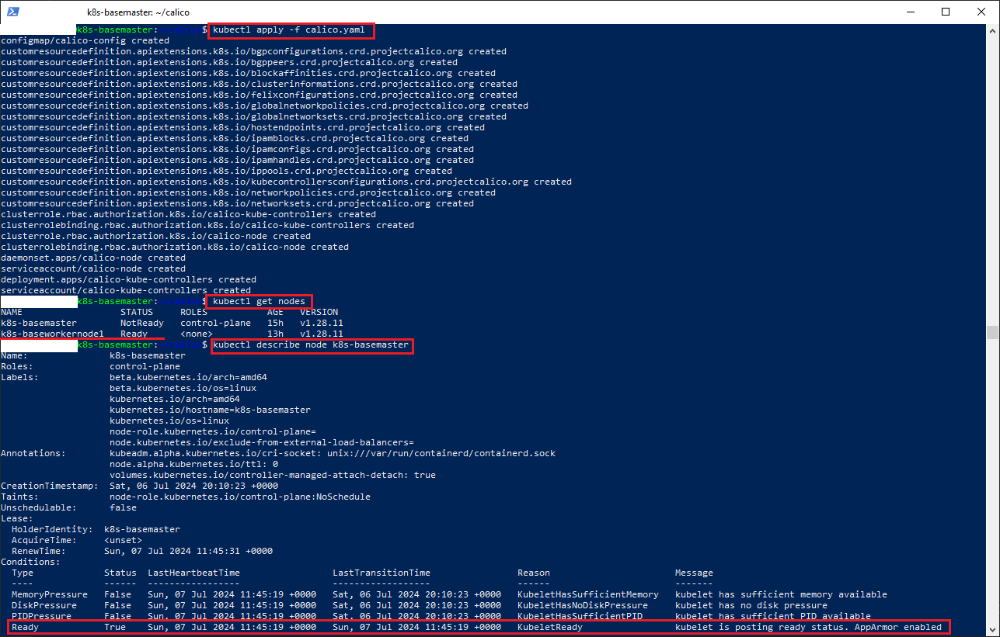

### Инструменты и дополнительные материалы, которые пригодятся для выполнения задания:

- [Considerations for large clusters](https://kubernetes.io/docs/setup/best-practices/cluster-large/),
- [Architecting Kubernetes clusters — choosing a worker node size](https://learnk8s.io/kubernetes-node-size).
- [Хорошее пособие по настройке кубов](https://github.com/BigKAA/youtube/blob/master/kubeadm/README.md)

------

### Задание. Необходимо определить требуемые ресурсы
Известно, что проекту нужны база данных, система кеширования, а само приложение состоит из бекенда и фронтенда. Опишите, какие ресурсы нужны, если известно:

1. Необходимо упаковать приложение в чарт для деплоя в разные окружения. 
2. База данных должна быть отказоустойчивой. Потребляет 4 ГБ ОЗУ в работе, 1 ядро. 3 копии. 
3. Кеш должен быть отказоустойчивый. Потребляет 4 ГБ ОЗУ в работе, 1 ядро. 3 копии. 
4. Фронтенд обрабатывает внешние запросы быстро, отдавая статику. Потребляет не более 50 МБ ОЗУ на каждый экземпляр, 0.2 ядра. 5 копий. 
5. Бекенд потребляет 600 МБ ОЗУ и по 1 ядру на копию. 10 копий.

### Решение

| Система                         |         CPU                                              |             Память                        |
|---------------------------------|----------------------------------------------------------|-------------------------------------------|
| Мастер нода                     |   2 ядра * 3 = 6 ядер, 3 ноды                            |  4 Гб *3 = 12 Гб                          |
| База данных                     | (3 + 0.06 + 0.01 + 0.005 = 4) ядра * 3 = 12 ядер, 3 ноды |  (4 Гб + 0.1 Гб + 1 Гб) *3 *3 = 46 Гб     |
| Кеш                             | (3 + 0.06 + 0.01 + 0.005 = 4) ядра * 3 = 12 ядер, 3 ноды |  (4 Гб + 0.1 Гб + 1 Гб) *3 *3 = 46 Гб     |
| Фронтенд                        | (0.2 + 0.06 + 0.01) * 5 = 2 ядро , 1 нода                |  0.05  Гб * 5 + 0.1 Гб + 0.255 Гб = 1 Гб  |
| Бекенд                          | (10 + 0.06 + 0.01 + 0.01 + 0.015) = 11 ядер, 1 нода      |  0.6 Гб + 0.1 Гб + 0.255 Гб = 1Гб         |
| Итого:                          |  ```43 ядра,  11 нод```                                  |  ```106 Гб```                             |  

#### Дополнительные условия использованные при расчете:

- У мастер-ноды минимальные требования: 2 ядра и 4 Гб памяти
- Для отказоустойчивости размещаем поды на 3 рабочих нодах. 
- Обеспечиваем отказоустойчивость мастер-нодам 
- Системными процессами(kubelet, kube-proxy) потребляется CPU: ```6 %``` на 1 ядре, ```1%``` на 2 и по ```0.5%``` на каждом ядре до 4 ядер, ```0.25%``` на кажом последующем ядре
- Системными процессами(kubelet, kube-proxy) потребляется памяти: ```255 Мб``` до 1 Гб, ```1 Гб``` от первых 4 Гб, ```0.8 Гб``` от вторых 4 Гб, ```0.8 Гб``` от следующих 8 Гб, ```6.72 Гб```(6%) от следующих 112 Гб.
- Существует минимальный объем свободной памяти при превышении которого под будет автоматически остановлен. Размер памяти равен ```0.1 Гб```

### Установка k8s c использованием kubeadm

1. kubelet не работает при включенном свопинге, для этого:
  - выполняем команду: ```sudo swapoff -a```
  - удаляем строку начинающуюся на **/swap.img** в файле **/etc/fstab**
2. устанавливаем ip_forwarding и фильтры моста. 
    1. Запускаем модуль фильтров(проверка наличия модуля: ```modinfo br_netfilter```, проверка что модули bridge и br_netfilter включены: ```lsmod```):
        - ```modprobe br_netfilter```
    2. В файле ```/etc/sysctl.conf``` устнавливаем значения:
        - ```net.ipv4.ip_forward=1```
        - ```net.bridge.bridge-nf-call-iptables=1```
    3. Применяем настройки sysctl:
        - ```sysctl -p /etc/sysctl.conf``` 
3. Сбрасываем настройки текущего куба, если такой был ранее установлен: 
   -  ```kubeadm reset```
4. Удаляем файл .kube\config  если такой есть: ```rm $HOME/.kube/config```
5. Устанавливаем обязательные пакеты: 
   - ```apt-get install apt-transport-https ca-certificates curl software-properties-common -y```
6. Устанавливаем kubelet, kubeadm, kubectl как на control plane, так и на рабочие ноды. Разница только в том что на мастер ноде запускаем ```kubeadm init```, на рабочей ноде запускаем ```kubeadm join```:
    - ```apt install -y kubeadm kubelet kubectl``` 
7. Фиксируем текущие версии, чтобы в дальнейшем не было расхождения между версиями kubectl, kubeadm  и kubelet:
    - ```apt-mark hold kubeadm kubelet kubectl```
8. Устанавливаем куб командой kubeadm:
    - ```sudo kubeadm init --pod-network-cidr=10.244.10.0/16 --apiserver-advertise-address=<ip-control plane>```

    ip-control plane берем как eth0 адрес из результата команды ```ip a```
9. Если команда возвращает сообщение, что запущены ряд процессов, то выполняем поиск из идентификаторов, а затем удаляем эти процессы из памяти:
   1. получаем список процессов командой:
          ```lsof -i +c0```
   2. удаляем процесс(используем значение в колонке PID процесса из предыдущей команды):
          ```kill <pid>```
10. копируем admin.conf в *.kube/config*:
        ```sudo cp -i /etc/kubernetes/admin.conf $HOME/.kube/config```
11. установливаем права файлу  .kube/config*:
        ``` sudo chown $(id -u):$(id -g) $HOME/.kube/config``` 
12. проверяем доступность куба командой:
        ```kubectl describe node```

В итоге имеем:


### Подключаем рабочую ноду:

1. Генерируем случайное название сессионного ключа, который будет действовать 24 часа:
   ```kubeadm token generate```
2. Для ключа  генерируем его значение:
   ``` kubeadm token create <имя ключ, полученное предыдущей командой> --print-join-command```
   Получим команду подключения к мастер-ноде, которую надо запомнить и ввести на рабочей ноде.
3. Копируем файл admin.conf с мастер ноды на рабочую ноду в каталог **~/.kube/config**:
   ```sudo scp /etc/kubernetes/admin.conf administrator@192.168.10.215:~/.kube/config```
4. Инсталируем среду запуска контейнеров(CRI):
   ```sudo apt-get install docker-ce docker-ce-cli containerd.io docker-buildx-plugin docker-compose-plugin```
   Если не находит репозиторий с **containerd.io**, то:
    - Добавляем ключ репозитория docker:
    ```curl -fsSL https://download.docker.com/linux/ubuntu/gpg | sudo gpg --dearmor -o /etc/apt/keyrings/docker-archive-keyring.gpg```
    - Прописываем репозиторий docker:
    ```echo "deb [arch=$(dpkg --print-architecture) signed-by=/etc/apt/keyrings/docker-archive-keyring.gpg] https://download.docker.com/linux/ubuntu $(lsb_release -cs) stable" | sudo tee /etc/apt/sources.list.d/docker.list```
5. Активируем сервис kubelet:
   ```systemctl enable kubelet```
6. Проверяем что в файле **/etc/containerd/config.toml**:
   ```enabled_plugins=["cri"]```
7. Запускаем команду присоединения к мастер ноде на рабочей ноде(обязательно под root из под пользователя):
   ```sudo kubeadm join <ip-мастер ноды>:6443 --token kznh8g.7vjbsqmb6zpzgs57 --discovery-token-ca-cert-hash sha256:9b9e6273e639dae468f0e49d225e735b63be45bd5f5bc393024bd56f0597c36c```

### Установка calico сети
- скачиваем манифест tigera оператора:
       ```curl https://raw.githubusercontent.com/projectcalico/calico/v3.28.0/manifests/tigera-operator.yaml -O```
- calico в режиме хранения данных kubernetes хранит настройки в виде ресурсов kubernetes. Скачиваем файл манифеста ресурсов:
      ``` curl https://raw.githubusercontent.com/projectcalico/calico/v3.28.0/manifests/custom-resources.yaml```
- устанавливаем ресурсы calico:
      ```kubectl create -f custom-resources.yaml```  
- устанавливаем оператор tigera(т.к. файлы большие то apply может выдать ошибку. Применяем create или replace):
      ```kubectl create -f tigera-operator.yaml``` 
- проверяем что сеть появилась командой:
      ```kubectl describe node```
В итоге создаются файлы в папке */etc/CNI* и появляется сеть в описании control plane ноды:

    
### Актуализируем репозиторий kubernetes 

Т.к. репозиторий  *apt.kubernetes.io* переехал и теперь находится *pkgs.k8s.io*:
- ССоздаем папку keyrings:
  ```mkdir -p /etc/apt/keyrings && cd /etc/apt/keyrings```
- Скачиваем публичный ключ (для версии 1.28) :
  ```curl -fsSL https://pkgs.k8s.io/core:/stable:/v1.28/deb/Release.key | sudo gpg --dearmor -o /etc/apt/keyrings/kubernetes-apt-keyring.gpg```
- Добавляем в файл kubernetes.list строку подключения к репозиторию:
  ```echo "deb [signed-by=/etc/apt/keyrings/kubernetes-apt-keyring.gpg] https://pkgs.k8s.io/core:/stable:/v1.28/deb/ /"> /etc/apt/sources.list.d/kubernetes.list```
- Проверяем что репозиторий подключен:
  ```apt update```

### Установка CRI

Если не запускается kubelet на control plane с ошибкой ```validate service connection: validate CRI v1 runtime API for endpoint```, то может потребоваться переустановка среды CRI. Возникает если установлены сразу 2 и более CRI. Основной причиной является то,  containerd может быть не совместим с установленными неофициальными версиями Docker Engine(docker.io, docker-compose, docker-podman) Кроме того новая версия containerd может быть несовместима с предыдущими версиями containerd и runc, поэтому выполняем следующие операции:
- удаляем ранее установленные пакеты Docker(*apt-get remove $pkg*): 
    ```for pkg in docker.io docker-doc docker-compose docker-compose-v2 podman-docker containerd runc; do sudo apt-get remove $pkg; done``` 
- Устанавливаем containerd командой(внутрь containerd входит runc):
    ```sudo apt-get install docker-ce docker-ce-cli containerd.io docker-buildx-plugin docker-compose-plugin```
- После установки включаем плагин CRI в containerd. Заходим и заменяем ```disabled_plugins``` на ```enabled_plugins=["cri"]```:
    ```nano /etc/containerd/config.toml```.
- После этого перезапускаем containerd и kubelet: 
    ```systemctl restart containerd & systemctl restart kubelet```
- Проверяем что kubelet запустился командой:
    ```systemctl status kubelet```
